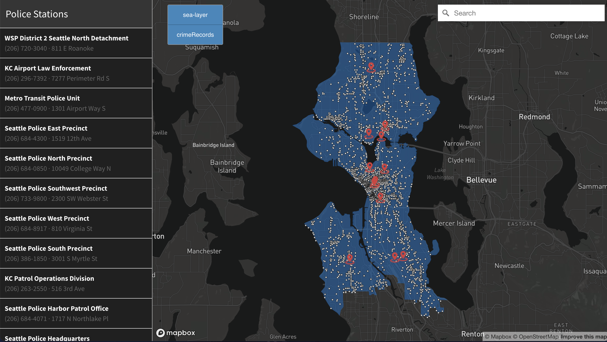

# Police Station Locations and Criminal Records in Seattle

## Project Description
The issue of criminal activity has been receiving a lot of attention in Seattle recently. Headlines abound about retail theft and gun violence. The incidence of criminal activity has risen. This web map interface depicts data on criminal records and law enforcement locations in the Seattle area. Specifically, our visualization includes all categories of law enforcement agencies, such as police and sheriff stations, patrol offices, etc. We also showcase the relative locations of the crime reports against people since July 2022, broken down by different categorical features, such as offense categories, precinct, etc. 

## Project Goal
To incorporate our topic of sorting by distance, we aim to achieve distance to searched location from the nearest law enforcement locations. Doing so will give the audience a clear visualization of data which will help them: 
- See crime density in the area
- See law enforcement locations in the area
- See the correlation between the above 2

Essentially, the user will be able to search for a location of interest, such as a location with high crime data, and they will be able to see the closest police stations in the sidebar from closest station to furthest.

The main two audiences that inspire the creation of this project are
1. The general public
2. Governing powers that operate law enforcements

The general public should have easy access to know the crimes happening within their areas of interest. We feel that our interface will benefit them to see where crime is committed and if law enforcement is close enough to minimize it. 

## MAP

## Main Functions
Our data makes use of one main function: geojsonFetch(). This function contains the meat of our functionality and makes use of smaller functions within. This function starts out with loading our external files using fetch. After that we load our layers on to the map. From there, we start by building a Geocoder to help assist us with controlling the search fucntions. From here on out, functions will be listed in the order they appear in our code.

buildLocationList(stations):
    This function adds each police station to the sidebar
 
addMarkers():
    This function adds a marker for every station listing

stations.features.sort():
    Sorts stations by distance from closest to the `searchResult` to furthest

createPopUp(stations.features[0]):
    This function creates a Mapbox GL JS `Popup` based on the station data.

getBbox(sortedStations, stationIdentifier, searchResult): 
    This function creates a Bbox that helps in sorting the stations from closest to furthest.
    
flyTo(currentFeature):
    This function uses Mapbox GL JS's `flyTo` to move the camera smoothly
    a given center point.

## Data Resouces
- [Seattle Boundaries Data](https://github.com/seattleio/seattle-boundaries-data/blob/master/data/city-limits.geojson)
- [Seattle Crime Data](https://data.seattle.gov/Public-Safety/SPD-Crime-Data-2008-Present/tazs-3rd5)
- [Police Station Locations](https://gis-kingcounty.opendata.arcgis.com/datasets/kingcounty::police-station-locations-in-king-county-kcp-loc-point/about)

## Applied Libraries & Web Services in Use
- Github
- Mapbox GL JS
- Seattle Open Data
- Seattle City GIS
- King County GIS Open Data

## Acknowledgment
This project is accomplished over the course of the Geography Department at UW. 

## Note
Due to the limitations on the size of the dataset allowed in order to have a fast and smooth render on the map, we chose to shrink our dataset to 1.6 megabytes, which means a large portion of criminal records data is not included and rendered on our map. From the original dataset, we filtered out: crime records before June 2022, crimes against properties, crimes against society, and crime reports that ended up not being a crime. We chose crime against a person as our only category of crime (this is different from offense categories) because we thought people are more concerned about crime against individuals (which includes human trafficking, assault offense, homicide, etc.). This type of crime needs more immediate attention from the police officers, which means the response time from police stations to the crime location will be short if the crime scene is close to a police station and long if it's far away from any police station.

